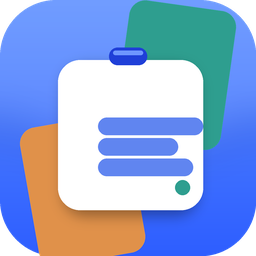
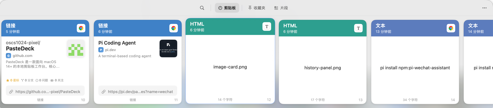
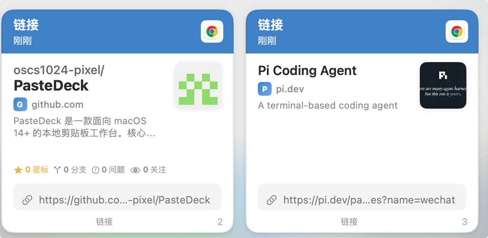
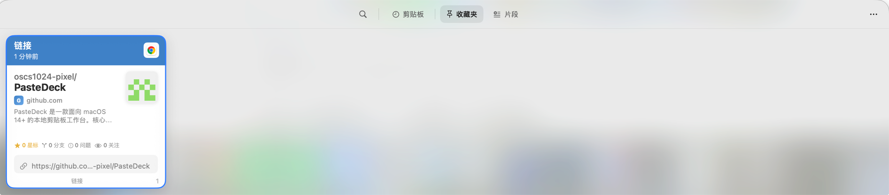
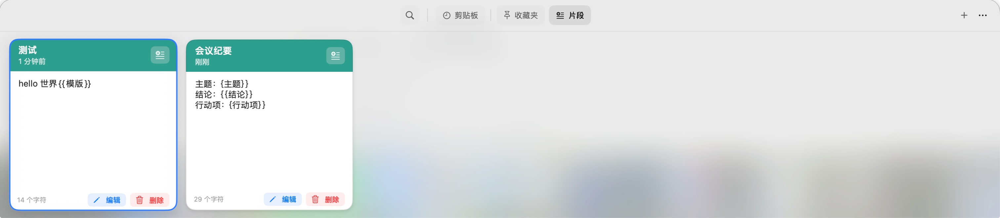
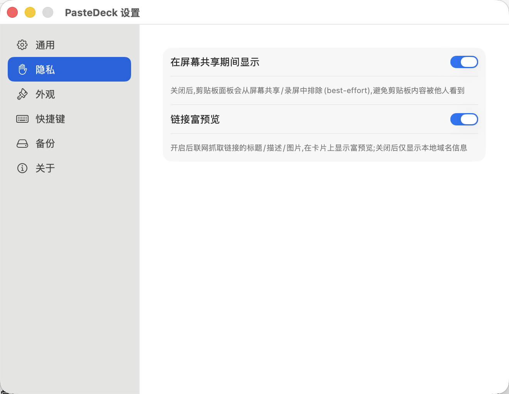
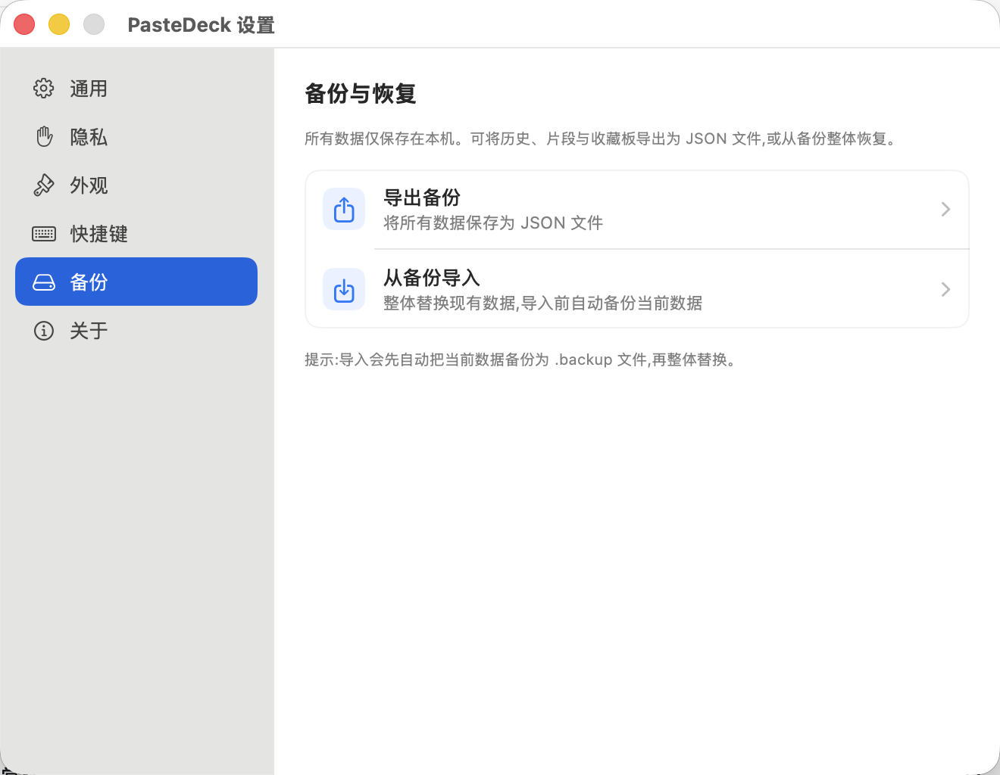
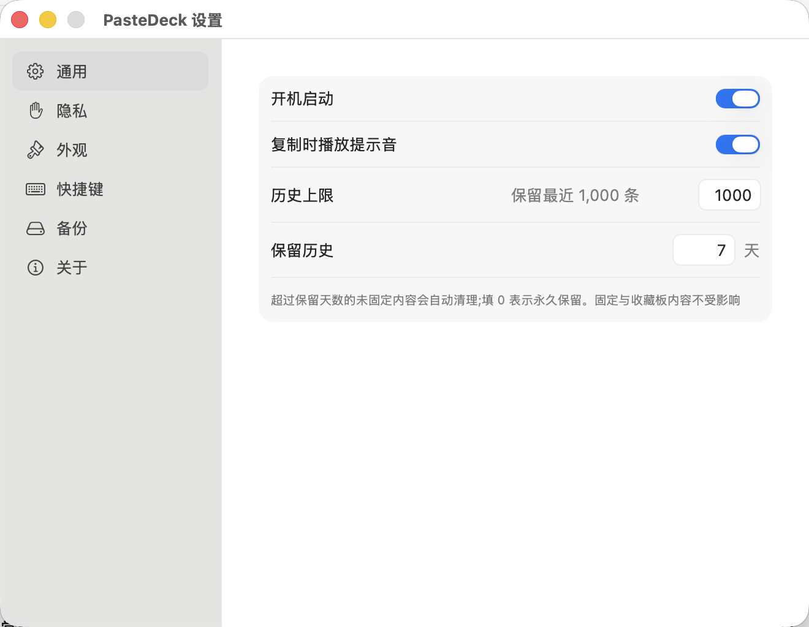

<p align="center">
  
</p>

<h1 align="center">PasteDeck —— 你的 Mac 剪贴板，从此有条理</h1>

<p align="center">
  <b>卡片式 · 键盘优先 · 数据只存在本机</b>
</p>

<p align="center">
  
  
  
  
  
</p>

---

## 你是否也有这些烦恼？

- 📋 复制了三段文字，切换窗口时才发现第一段已经被覆盖了；
- 🔍 想找回半小时前复制的那条链接，翻遍聊天记录一无所获；
- ⌨️ 每天重复输入同样的问候语、地址、代码片段；
- 🔒 担心剪贴板里的密码、截图被上传到谁的服务器。

**PasteDeck 把剪贴板变成一块可视化工作台：复制过的一切触手可及，而且哪儿也不去——数据 100% 留在你的 Mac 上。**

---

## 🎴 一眼看懂：贴底卡片面板

按下 `⌘⇧V`，一块贴着屏幕底部的卡片面板滑入视野。你复制过的每一条内容都变成一张卡片，横向排开，最新在最左。



每张卡片自动识别内容类型——**文本、富文本、HTML、图片、链接、文件、颜色**，配上类型配色、相对时间、来源应用图标和序号，一眼锁定目标。卡片有紧凑 / 标准 / 大三档尺寸，随你的屏幕和喜好自适应。

---

## ⚡ 取用快到没有痕迹

| 动作 | 效果 |
| --- | --- |
| **单击卡片** | 立即复制，面板保持打开，继续挑下一条 |
| **双击卡片** | 直接粘贴回你原本工作的应用，面板自动收起 |
| **Return** | 键盘党福音：方向键选中，回车直接粘贴 |
| **⇧Return** | 粘贴为纯文本，甩掉网页样式 |
| **⌘1…9** | 数字键盲取前 9 条，快过一切鼠标操作 |

粘贴队列也一并就绪：**Shift 连选、⌘ 点多选**，把多条内容放进 Paste Stack，按 `⌃⌘V` 一条条依序粘出——填表、搬运内容的效率翻倍。

---

## 🔍 搜得到，才配叫历史

在面板里直接打字即可搜索，范围不只是正文：

- ✅ 正文与自定义标题（支持重命名）
- ✅ **来源应用、来源设备**（"刚才在 Safari 复制的那条"）
- ✅ 链接标题与描述
- ✅ **图片里的文字**——本地 Vision OCR 自动识别，截图里的电话号码也能搜出来

再叠加**类型 / 日期 / 应用 / 设备**四维过滤，搜索状态以胶囊展示、随时清除，千条历史也能秒级定位。

---

## 🔗 链接富预览：剪贴板里的收藏夹展示柜

复制一个链接，PasteDeck 立即后台抓取网页标题、描述和配图。复制 GitHub 仓库时更是直接展示**头像、星标、分支、Issue、Watch 数**——链接卡片不再是一串冷冰冰的字符。



> 抓取有节流（5 并发、大小上限、失败重试有上限），且这是**唯一联网的内容处理功能**——不喜欢？设置里一键关闭，卡片自动回到纯本地展示。

---

## 📌 收藏夹：重要的东西永不丢失

右键任何卡片即可收藏。收藏夹是干净的单层平铺——不建目录、不搞层级，重要的内容一眼扫完。



两个贴心的细节：

- **红点是"真未读"**：基于你上次查看收藏夹的时间，新收藏才亮红点，进去即消；
- **清理不误伤**：清空历史或到期清理时，已收藏的内容自动转为"仅收藏可见"，永远不会丢。

---

## ✂️ 片段：常用文本，一次填写，处处复用

把签名、地址、常客邮件存成片段。支持 `{{占位符}}` 模板——插入时弹出填写面板，变量即时展开：



- 双击无占位符片段 → 直接粘贴；
- 有占位符 → 弹出表单填写后粘贴；
- 方向键导航、Shift/⌘ 多选、批量删除，和历史页一套操作逻辑，零学习成本。

---

## 🪟 Quick Look：空格看全貌

按 `Space` 在面板上方展开独立预览窗，方向键切换条目时预览跟随：

- 🖼 图片：原始分辨率等比查看
- 📄 文件：调用系统 Quick Look，PDF / 文档 / 媒体通吃
- 🌐 链接：可控的网页预览（无持久 Cookie、禁 JavaScript）
- 🎨 颜色：色块 + 色值一并呈现

---

## 🔒 隐私是底线，不是选项

PasteDeck 的设计原则只有一条：**你的剪贴板只属于你。**

- 🏠 **默认本地存储**——无账号、无遥测、无后台服务器、无跨设备同步；
- 🧠 图片 OCR 用系统 Vision **在本机执行**，25MB 以上大图自动跳过；
- 🌐 唯一联网的链接富预览**可随时关闭**，关闭即取消所有待处理请求；
- 🖥️ 屏幕共享时可以自动隐藏面板，直播 / 会议不泄露剪贴板；
- 💾 数据完整 JSON 导出 / 导入，导入前自动做安全快照，校验不过不动你一根数据。



---

## 🛠 顺手的好细节

**自动瘦身**：默认保留 1000 条 / 7 天，任一条件到期即清理最旧的可清理记录；固定和收藏的内容豁免。上限、天数都在设置里可调。

**备份自由**：一键导出全部历史、收藏、片段与元数据，换机迁移不丢数据。



**外观随你**：浅色 / 深色 / 跟随系统三档主题，三档卡片尺寸，设置即时生效。

**快捷键随你**：面板、Paste Stack、清理历史的全局快捷键都可重新录制。



---

## ⌨️ 快捷键速查

| 快捷键 | 动作 |
| --- | --- |
| `⌘⇧V` | 打开 / 关闭底部面板 |
| `←` `→` | 移动选中卡片 |
| `⇧←` `⇧→` | 连续多选 |
| `Return` | 直接粘贴（未授权辅助功能时为复制） |
| `⇧Return` | 纯文本直接粘贴 |
| `⌘1…9` | 快速取用第 1–9 项 |
| `Space` | Quick Look 预览 |
| `Esc` | 清搜索 → 关预览 → 清多选 → 关面板 |
| `⌘←` `⌘→` | 切换 剪贴板 / 收藏夹 / 片段 |
| `⌘⇧C` | 启动 / 停止 Paste Stack 收集 |
| `⌃⌘V` | 粘贴 Paste Stack 下一项 |
| `⌘⇧Delete` | 清空未固定历史 |

---

## 🚀 立即上手

**系统要求**：macOS 14 Sonoma 及以上，Apple Silicon 或 Intel。

**本地构建**（ad-hoc 签名，无需开发者账号）：

```bash
brew install xcodegen
bash scripts/build.sh
open build/DerivedData/Build/Products/Debug/PasteDeck.app
```

或从 `release/` 目录获取已打包的 DMG（arm64 / x86_64）。

> 首次使用"直接粘贴"需在「系统设置 → 隐私与安全性 → 辅助功能」中授权；不授权也完全可用，双击 / 回车会自动退化为复制。

---

<p align="center">
  <b>PasteDeck —— 复制即收藏，按下即抵达。</b><br>
  <sub>MIT 开源</sub>
</p>
