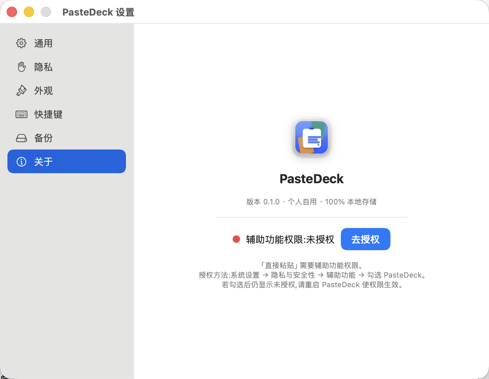

# PasteDeck 功能说明

PasteDeck 是一款面向 macOS 14+ 的本地剪贴板工作台。核心体验是贴底横向卡片、键盘快速取用、单层收藏夹、模板片段与可控的链接富预览。

## 1. 剪贴板面板

PasteDeck 识别文本、富文本、HTML、图片、链接、文件、颜色与其他内容。每张卡片包含类型、相对时间、来源应用图标、内容预览和序号，并随紧凑/标准/大三档尺寸自适应排版。

- 左键单击：复制，面板保持打开，便于连续取用。
- 双击：直接粘贴到打开面板前的应用。
- 右键：纯文本复制、固定、收藏、重命名、删除或批量操作。
- 点击面板外、按 Esc 或再次触发快捷键：收起面板。

图片卡片使用下采样缩略图保证滚动性能，空格预览时读取原始数据。

## 2. 搜索、过滤与 OCR

面板中直接输入即可开始搜索，搜索范围包括：

- 正文和自定义标题；
- 来源应用与来源设备；
- 链接标题、描述；
- 图片中的本地 OCR 结果。

菜单支持按内容类型、日期、来源应用和设备过滤。过滤状态以可清除胶囊显示，并在剪贴板、收藏夹和片段之间共享；片段页使用关键词、文本类型和日期过滤。

图片 OCR 使用 macOS Vision，在记录保存后异步补写索引，不阻塞下一次剪贴板轮询。单张原始数据超过 25 MB 时跳过 OCR，以控制峰值内存。

## 3. 链接富预览

复制链接后立即在后台抓取 Open Graph 标题、描述和图片，不等面板打开。GitHub 仓库链接额外显示仓库头像、星标、分支、问题和关注数；窄卡片会省略统计文字标签，但不会丢失“关注”数据。

性能和隐私策略：

- 最多 5 个并发任务，同一主机最多 3 个连接；
- HTML 最大 2 MB，图片最大 5 MB，GitHub JSON 最大 1 MB；
- 同 URL 元数据和图片使用有界内存缓存；
- 失败按 15 / 60 / 300 秒最多重试 3 次；
- 拒绝 localhost、常见内网 IPv4 与私有 IPv6 地址；
- 设置中关闭后取消待处理抓取与重试，卡片和 Quick Look 切回本地展示。

## 4. 收藏夹

收藏夹是固定的单层入口，不包含目录创建、编辑、删除或拖拽排序。历史自动清理或手动清空时，被收藏的同一内容会转为“仅收藏可见”，不会丢失。

红点表示“上次进入收藏夹以后新增了收藏”，进入收藏页立即标记为已读，不使用固定 24 小时窗口。

## 5. 片段

片段用于保存经常输入的文本，可随时新建、编辑和删除。内容中的 `{{变量名}}` 会在插入时生成填写项，允许同一变量重复使用与空格写法。

- 方向键选择，Return 复制；
- 双击无占位符片段直接粘贴；
- 有占位符时打开填写面板；
- Shift 连选、⌘ 点击增减、⌘A 全选；
- 批量复制到 Paste Stack 或批量删除。

## 6. Paste Stack

Paste Stack 是独立的值快照队列，不持有可能被历史清理删除的 SwiftData 对象。

- `⌘⇧C`：开始/停止收集后续外部复制内容；
- `⌃⌘V`：粘贴下一项；
- “…”菜单：查看数量、移除单项、切换正序/倒序、清空；
- 多选卡片也可直接生成 Stack。

## 7. Quick Look

按空格在底部面板上方打开独立预览，方向键可在预览保持打开时切换条目。

- 图片：原始数据等比预览；
- 文件：系统 Quick Look，支持系统可识别的 PDF、文档、媒体等格式；
- URL：富预览开启时使用无持久 Cookie、禁用 JavaScript 的网页视图；关闭时只显示本地链接；
- HTML/RTF：按富文本解析；
- 文本：可选中复制；
- 颜色：显示色块和色值。

## 8. 历史生命周期

默认历史上限为 1000 条，默认保留 7 天。两个条件独立判断，任一先满足都会触发最小范围清理：

1. 总历史条数超过上限：从最早的未固定记录开始清理，直至达到上限；
2. 未固定记录超过保留天数：清理全部到期记录；
3. 固定内容不被自动删除；
4. 收藏内容转为仅收藏可见；
5. 除自动规则和用户明确执行的清空/删除外，没有其他隐式清理入口。

## 9. 设置

### 通用

真实读取并切换登录启动状态、复制反馈音、历史上限、保留天数和清空历史。数值只在 Return 或输入框失焦时校验提交，输入过程中不会触发清理。

### 隐私

配置屏幕共享显示、链接富预览和本地图片 OCR。说明文字明确标记联网与离线边界。

### 外观

主题支持跟随系统、浅色和深色；卡片支持紧凑、标准和大。选择状态立即改变，设置持久化并同步到已打开的面板与窗口。

### 快捷键

可重新录制面板、Paste Stack 和清理历史的全局快捷键；页面同时列出固定的面板内按键。

### 备份

JSON 导出包含历史、收藏、片段、来源设备、OCR 与链接元数据。导入先完整校验，随后在一次事务中替换；导入前会自动写入当前数据安全快照。

### 关于与权限

显示应用图标、版本、存储承诺和辅助功能实时状态。授权完成后无需重启即可刷新为已允许。

## 10. 快捷键总览

| 快捷键      | 功能                              |
| ----------- | --------------------------------- |
| `⌘⇧V`       | 打开/关闭面板                     |
| `←` / `→`   | 移动选择                          |
| `⇧←` / `⇧→` | 连续多选                          |
| `⌘A`        | 选择当前页面全部可见项            |
| `⌘C`        | 把多选内容放入 Paste Stack        |
| `Return`    | 直接粘贴；未授权时复制            |
| `⇧Return`   | 纯文本直接粘贴                    |
| `⌘1…9`      | 快速粘贴当前页面第 1–9 项         |
| `Space`     | Quick Look                        |
| `Esc`       | 清搜索 → 关预览 → 清多选 → 关面板 |
| `⌘←` / `⌘→` | 切换剪贴板 / 收藏夹 / 片段        |
| `⌘⇧C`       | 启动/停止 Stack 收集              |
| `⌃⌘V`       | 粘贴 Stack 下一项                 |
| `⌘⇧Delete`  | 清空未固定历史                    |
